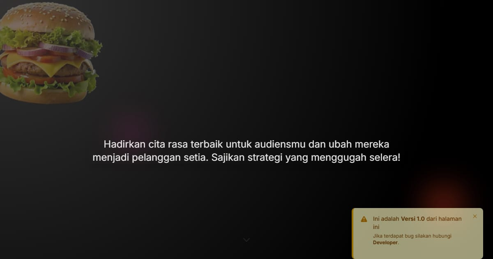

# Tasty Corner — Strategi F&B yang Menggugah Selera

Tasty Corner: hadirkan cita rasa terbaik untuk audiensmu dan ubah mereka menjadi pelanggan setia.

**Demo live:** https://landing-tastycorner.vercel.app



> Template landing page untuk bisnis fiktif. Formulir di dalamnya hanya demo dan tidak mengirim data.

## Konsep

Bahasa rupa **Struk** belanja: kertas putih, huruf rata lebar, garis sobek putus-putus, dan angka yang berbaris rapi. Lugas dan cepat dibaca.

## Halaman

`/`

## Teknologi

- Next.js 15.5 (App Router) dan React 19
- Tailwind CSS v4
- JavaScript
- Heroicons, Framer Motion
- Font: Bricolage Grotesque, Inter (next/font)
- SEO: metadata per halaman, Open Graph, JSON-LD, sitemap.xml, dan robots.txt

## Menjalankan secara lokal

```bash
npm install
npm run dev
```

Buka http://localhost:3000. Untuk build produksi: `npm run build` lalu `npm start`.

---

Bagian dari koleksi 17 template landing page di [PortalLanding](https://portal-landing-seven.vercel.app). Dibuat oleh [PintuWeb](https://pintuweb.com), jasa pembuatan website.
